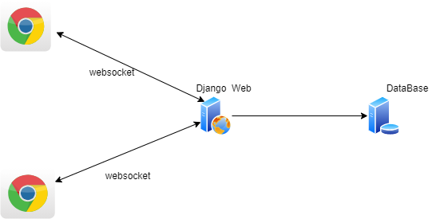
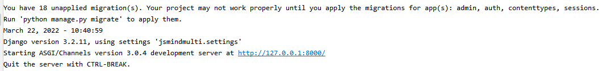
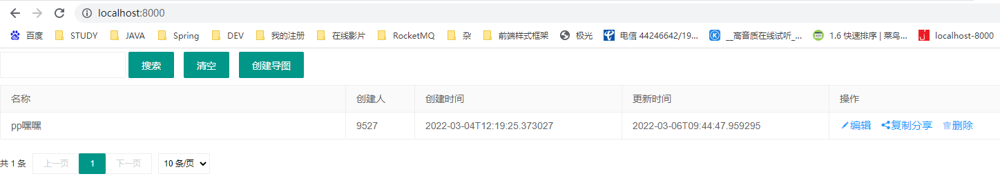

# jsmindmulti

jsmind思维导图多人协作版（可本地安装、可扩展源码）

#### 介绍

+ 多人协作脑图，站在巨人的肩膀上：前台是赫赫有名的开源的 [jsMind](http://hizzgdev.github.io/jsmind/developer.html) （可自己改源码，接口丰富、扩展性强），做了小小的改动；
+ 适合不能访问外网、或者不想把数据放外网的公司（现在很多互联网免费的协作脑图产品，但是有的敏感数据并不想放外网）
+ 多人协作思维导图主要采用python django框架，如果不熟悉的需要先补一下；
+ Django快速入门视频推荐：[https://www.bilibili.com/video/BV1JW411i7W1](https://www.bilibili.com/video/BV1JW411i7W1)
+ 选择python是因为感觉用django开发一个简单网页会比java更快，但是这里我要吐槽一下python里用缩进区分语句块，稍不注意代码就乱了（感觉还是大括号好）

#### 软件架构

<hr>



<hr>

#### 安装教程

+ 安装依赖
    - 安装python，我本地是Python 3.7.8rc1，版本比这个大就应该可以
    - 安装依赖，在工程根目录执行 pip install -r reuqirements.txt 将项目的依赖安装到python目录（类似java里的maven），如果相关把依赖安装到其他目录进行分类管理可以采用virtualenvwrapper
    -    
    - 
  
+ 数据库
    - 在 jsmindmulti/settings.py 的 DATABASES 进行配置，配置文件里默认用的mysql，可以改成django支持的数据库
    -  
    - 
    - 初始化数据库脚本，执行以下命令就会将系统运行所需要的表结构创建好
      ```
       python manage.py makemigrations
    
       python manage.py migrate
      ```
+ 启动程序
    - 开发环境启动可以在项目根路径里直接执行 python manage.py runserver 0.0.0.0:8000 开启本地的服务；如果是生产环境，还需要加入nginx(我理解是提高并发等，参考：https://www.jianshu.com/p/3172566156fe/)
    -
    - 

#### 效果
+ 通过浏览器 http://localhost:8000/ 访问主页
+ 



+ 点击"编辑"详情
+
